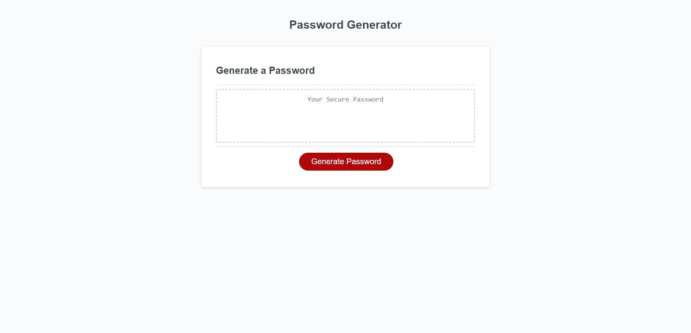

# Challenge 3 Password Generator

## JavaScript Password Generator
This website showcases newly aquired javaScript applications learned from module 3. Giving logic to new variables and arrays I was able to utalize functions, if/else statements,                              
and for loops to generate a new password given the criteria the user sets through a series of window prompts. 

## Usage 

#### How to
- Start by clicking the "Generate Password" button
- Select between 8 and 128 characters
- Confirm lowercase characters
- Confirm uppercase characters
- Confirm number characters
- Confirm special charcters

**Then a random generated password is provided with the limitations set by the user!!**

## License
MIT

## Links

[Deployed Page](https://jon-dev092.github.io/challenge-3-/)                                                                                                                                                                                    
[Github Repo](https://github.com/jon-dev092/challenge-3-)

